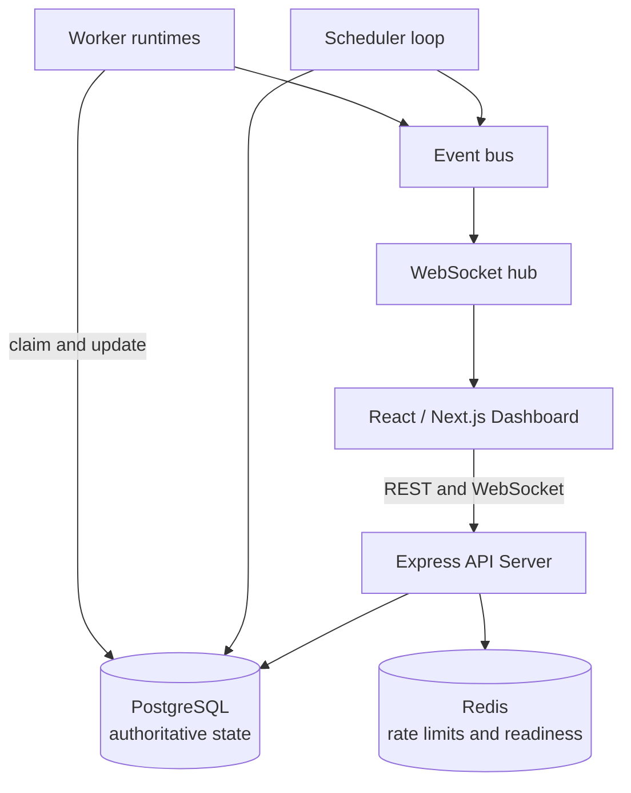
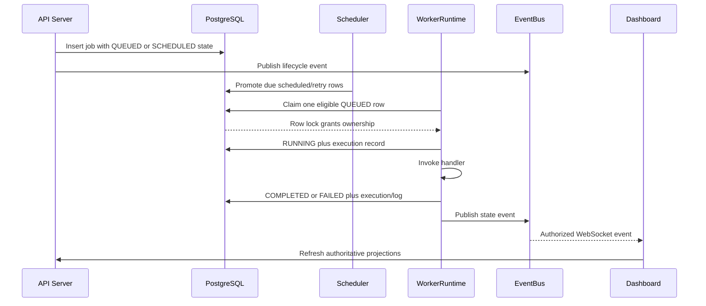
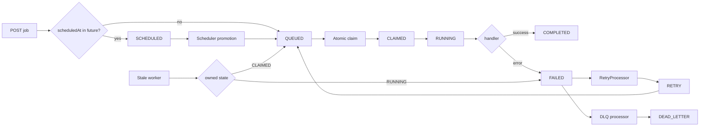

# Architecture

## Executive Overview

The Distributed Job Scheduler is a PostgreSQL-backed scheduling and execution service with a REST API, WebSocket event channel, scheduler loop, worker runtime, and Next.js operational dashboard. The core invariant is that PostgreSQL is the authoritative durable source of job state and the authority for job ownership.

The repository contains two operating modes: reusable core services (`Scheduler`, `WorkerRuntime`, retry, recovery, and DLQ processors) and a runtime bootstrap that starts an HTTP/WebSocket server, creates one synthetic runtime worker per existing queue, polls schedules and retries, and executes jobs with a built-in success handler.

## Problem and Goals

The system coordinates delayed work across concurrent workers without relying on process memory. It provides durable state, ordered priority polling, tenant isolation, attempt history, controlled state transitions, failure visibility, and an operator-facing view of the system.

Goals are durable scheduling, safe concurrent claiming, explicit lifecycle state, operational diagnosis, and clear failure boundaries. Non-goals in the current implementation are a general external worker registration protocol, exactly-once side effects, a distributed metrics backend, and a fully administrative control plane.

## High-Level Architecture

The control plane is `Dashboard -> REST/WebSocket -> API Server -> PostgreSQL`. The execution plane is `Scheduler -> eligibility -> Job rows -> Workers`. Redis is not between a job and a worker: the worker claims directly from PostgreSQL.

## Component Responsibilities

| Component | Responsibility | Source of truth |
|---|---|---|
| API server | Authentication, validation, authorization, CRUD, lifecycle commands | PostgreSQL |
| PostgreSQL | Durable entities, state transitions, locks, history | Authoritative |
| Scheduler | Cron validation, recurring materialization, due-job promotion | PostgreSQL |
| WorkerRuntime | Poll, claim, execute handler, persist attempt result | PostgreSQL |
| WorkerRecovery | Heartbeats, stale detection, claim recovery, running failure marking | PostgreSQL |
| RetryProcessor | Backoff calculation, retry scheduling, due retry promotion | PostgreSQL |
| DLQ processor | Convert exhausted failures into diagnostic entries | PostgreSQL |
| Event bus/WebSocket hub | In-process publication and authorized fan-out | Ephemeral delivery |
| Redis | Rate-limit counters and readiness ping | Auxiliary |
| Frontend | Operational views and commands | API plus event notifications |

## Runtime Flow

## Submission, Execution, and Recovery

## Scaling Model

Workers can be added because ownership is decided by row locking rather than a process-local list. Priority and eligibility indexes make the hot claim query selective. API instances can share PostgreSQL, but the current event bus and metrics registry are process-local, so multi-instance WebSocket fan-out and metrics aggregation require an external coordination/collection layer. Scheduler ticks are also not globally coordinated; multiple scheduler instances would need an explicit lease or leader protocol.

## Reliability Boundaries

PostgreSQL transactions protect state changes and claim ownership. Handler side effects occur outside the database transaction, so a process crash can leave an external side effect ambiguous. WebSocket delivery is best-effort and recoverable by refetching. Redis failure does not change job state; rate-limit behavior is fail-open and readiness reports Redis failure.

## Source of Truth

The `Job` row is the current lifecycle projection. `JobExecution` preserves each attempt, and `JobLog` preserves execution messages. `ScheduledJob` is a recurrence definition, not an execution. `DeadLetterEntry` is diagnostic DLQ metadata associated with a terminal job. WebSocket events and in-memory metrics are derived operational signals; they must not be used to reconstruct authoritative state.
