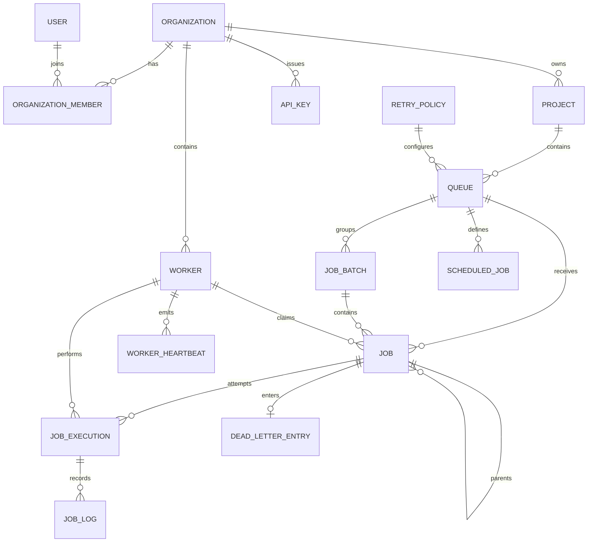

# Database Design

Prisma targets PostgreSQL. UUID primary keys and explicit foreign keys define tenant and lifecycle relationships. Restrictive deletes protect operational history; cascades are used where child records have no meaning without the parent.

## Entity Catalog

| Entity | Purpose and important fields | Keys, relationships, and constraints |
|---|---|---|
| `Organization` | Tenant boundary: `name`, timestamps | UUID PK; owns members, projects, workers, API keys; name index |
| `User` | Login identity: unique `email`, `passwordHash`, `name` | UUID PK; membership through `OrganizationMember` |
| `OrganizationMember` | User-to-tenant role mapping | UUID PK; FKs to organization/user with cascade; unique `(organizationId,userId)`; indexes by user and organization/role |
| `Project` | Namespace within an organization | UUID PK; organization FK restrict; unique `(organizationId,name)`; organization index |
| `RetryPolicy` | Queue retry configuration | UUID PK; strategy, attempts, delays, multiplier, jitter flag; name index |
| `Queue` | Work partition and policy boundary | UUID PK; project/retry-policy FKs restrict; unique `(projectId,name)`; indexes by project, policy, and pause state |
| `JobBatch` | Group identity and initial counters | UUID PK; queue FK restrict; one-to-many jobs; `(queueId,createdAt)` index |
| `Job` | Current durable job projection | UUID PK; queue FK restrict; optional batch/parent FKs set null; unique `(queueId,idempotencyKey)`; claim, schedule, priority, attempt fields and claim/status indexes |
| `JobExecution` | One record per attempt | UUID PK; job FK cascade, worker FK restrict; unique `(jobId,attemptNumber)`; job/time and worker/status indexes |
| `JobLog` | Messages for an execution | UUID PK; execution FK cascade; `(executionId,createdAt)` index |
| `Worker` | Worker identity and current health | UUID PK; organization FK restrict; unique `(organizationId,name)`; status/heartbeat indexes |
| `WorkerHeartbeat` | Append-only heartbeat history | UUID PK; worker FK cascade; `(workerId,recordedAt)` index |
| `ScheduledJob` | Recurring schedule definition | UUID PK; queue FK restrict; `(queueId,enabled,nextRunAt)` and `nextRunAt` indexes |
| `DeadLetterEntry` | Diagnostic record for exhausted failure | UUID PK; unique job FK cascade; optional last-worker FK set null; failure/requeue indexes |
| `ApiKey` | Hashed organization credential | UUID PK; organization FK cascade; unique `keyHash`; organization/revocation/expiry index |

## Relationship Model

## Important Design Choices

`Job.payload` and `JobLog.metadata` use JSON because job types have different input shapes and the scheduler must persist opaque application data without a schema migration for every handler. Validation constrains the envelope, not arbitrary payload contents. PostgreSQL JSON/JSONB is durable and queryable, although the current hot-path indexes are on lifecycle fields rather than payload content.

Current state and history are separate deliberately. `Job` supports cheap operational queries and ownership updates; `JobExecution` preserves attempt number, worker, duration, and error details without overwriting prior attempts. `JobLog` attaches messages to a particular attempt.

Queue configuration is separate because pause state, default priority, concurrency setting, and retry policy apply to many jobs. `priority` is copied to each job at creation so the claim query can order rows without repeatedly resolving a queue default. `scheduledAt` is intentionally reused for delayed eligibility and retry-backoff eligibility.

Idempotency is scoped to a queue through the unique `(queueId,idempotencyKey)` constraint. A duplicate request can return the existing job, but a null key is not deduplicated. Recurring occurrences use generated keys of the form `scheduler:<definition>:<timestamp>`.

## Transaction and Delete Semantics

Batch creation creates the batch and all jobs in one `ReadCommitted` transaction. Claiming locks the candidate row and updates ownership in the same transaction. Starting an attempt updates the job and creates its execution record transactionally. Recovery changes worker state and owned jobs transactionally. Job deletion is not an operational API; foreign-key behavior therefore protects records rather than exposing destructive cleanup.

Cascade relationships remove membership children, heartbeat history, execution history, logs, or DLQ metadata only when their parent is removed. Restrict relationships prevent deleting a tenant, project, queue, retry policy, or worker while dependent operational data still references it. `ApiKey` follows its organization with cascade.

## Indexing Strategy

The primary claim index `(status, scheduledAt, priority DESC, createdAt ASC)` supports due-job filtering and deterministic priority/FIFO ordering. `(queueId,status)` supports queue views and queue-scoped work. `(claimedBy,status)` supports recovery. Time/status and ownership indexes support execution, heartbeat, schedule, and DLQ inspection. Pagination uses ordered timestamps/creation fields, though the API currently implements offset pagination (`skip`/`take`) rather than cursor pagination.
