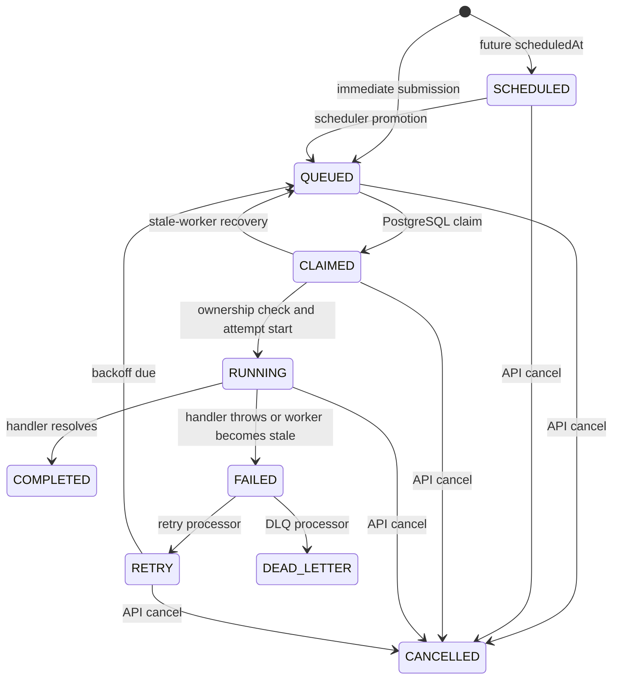

# Job Lifecycle

`jobStateMachine.ts` centralizes the permitted transitions. This prevents callers from silently inventing states, although not every write path invokes the state machine before its database update.

## State Diagram

## State Semantics

| State | Meaning and writer | Database/worker/event behavior |
|---|---|---|
| `QUEUED` | Eligible for claiming; API submission, schedule promotion, or retry promotion | `scheduledAt` is due; worker claim query considers it; `job.queued` or promotion event |
| `SCHEDULED` | Concrete delayed/recurring occurrence is not yet eligible | `scheduledAt` is future; scheduler emits `job.scheduled`, then `job.schedule.promoted` |
| `CLAIMED` | A worker owns the row but has not started execution | `claimedBy` and `claimedAt` set; no second worker may claim the locked row; `job.claimed` |
| `RUNNING` | An attempt is executing | `attemptCount` increments and a `JobExecution` is created; `job.running` |
| `COMPLETED` | Handler returned without throwing | Execution completes, claim clears, `job.completed`; terminal |
| `FAILED` | Attempt ended with an error or stale-worker recovery | Execution stores error; claim clears; `job.failed`; retry or DLQ processing may follow |
| `RETRY` | Failed job waits for calculated backoff | `scheduledAt` is the next eligibility time; `job.retry` |
| `DEAD_LETTER` | Retry exhaustion has been recorded for operator action | One `DeadLetterEntry`; terminal until explicit DLQ requeue updates the job to `QUEUED` |
| `CANCELLED` | User cancelled a non-terminal job | Claim fields clear; `job.cancelled`; terminal |

## Valid and Invalid Transitions

Valid transitions are:

- `QUEUED -> CLAIMED | CANCELLED`
- `SCHEDULED -> QUEUED | CANCELLED`
- `CLAIMED -> RUNNING | QUEUED | CANCELLED`
- `RUNNING -> COMPLETED | FAILED | CANCELLED`
- `FAILED -> RETRY | DEAD_LETTER`
- `RETRY -> QUEUED | CANCELLED`

Completed, dead-lettered, and cancelled jobs have no state-machine successors. There is no direct `FAILED -> COMPLETED`, `COMPLETED -> QUEUED`, or `DEAD_LETTER -> RUNNING`; DLQ requeue explicitly returns a job to `QUEUED` for a new claim. The API cancel path validates its allowed set; retry, promotion, and recovery assert their intended transition.

## Attempt and Event Semantics

`attemptCount` increments when a claimed job enters `RUNNING`, not when it is merely claimed. Each attempt receives a unique `(jobId, attemptNumber)` execution record. Events contain event ID, timestamp, tenant/resource IDs, status, previous status, attempts, and error fields. Events are notifications, not the durable state machine; a dashboard must refetch after receiving one.

## Operational Caveats

The runtime bootstrap promotes retries and schedules on its scheduler interval, but handler failures are not automatically sent to retry or DLQ by `WorkerRuntime`; those processors must be invoked by the surrounding orchestration. Batch counter fields are not updated by these transitions. Queue pause blocks scheduled materialization and scheduled-job promotion, but the current claim query does not itself test pause state.
