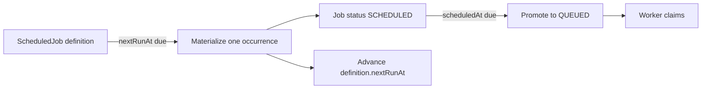

# Scheduler

## Definitions and Concrete Jobs

A `ScheduledJob` is a recurrence definition: queue, job type, payload, cron expression, enabled flag, and `nextRunAt`. A concrete `Job` is the durable execution unit with its own status, attempt count, priority, idempotency key, and execution history. Keeping these separate prevents a recurring definition from being confused with one execution occurrence.

## Job Types of Timing

- Immediate jobs are created as `QUEUED` with `scheduledAt` set to now.
- Delayed jobs are created as `SCHEDULED` when `scheduledAt` is in the future; the scheduler promotes them when due.
- Recurring jobs use a `ScheduledJob` definition and cron-parser to compute the next occurrence. Each materialized occurrence is a normal concrete job.
- Retry delays reuse `Job.scheduledAt` and the `RETRY` state; they are not schedule definitions.

## Materialization Coordination

`materializeDueScheduledJob` locks the definition row in a transaction, checks enabled/due/queue-paused conditions, creates one concrete `SCHEDULED` job, computes the next cron time, and updates `nextRunAt` before commit. The occurrence idempotency key is `scheduler:<definition-id>:<occurrence-ISO-time>`, and the job uniqueness constraint prevents duplicate occurrence identity within a queue.

The bootstrap loops through queues every configured scheduler interval (default 5 seconds). For each queue it promotes due concrete scheduled jobs, promotes due retries, then materializes due definitions. Cron expressions are validated when a definition is created through the core service. The HTTP API currently exposes only `GET /scheduled-jobs`; there is no public create/update/delete schedule route.

## Pause and Restart Behavior

A paused queue prevents recurring materialization and scheduled promotion in the scheduler queries. Restarting the scheduler reads persisted `nextRunAt` and job rows from PostgreSQL, so schedule progress is not held only in memory. A due definition is materialized one occurrence at a time; if a scheduler fails before the transaction commits, the locked transaction rolls back. Multiple scheduler instances are not coordinated by a lease, so active-active scheduler deployment is not an established guarantee.

## Timing Guarantees

The scheduler is polling-based, so execution is eventually eligible after the poll interval and database work completes; it is not a real-time timer. A recurring definition advances to the next cron occurrence. If the computed next occurrence is already behind the current time, the implementation recalculates from the current database time to avoid repeatedly materializing a backlog of old occurrences.
