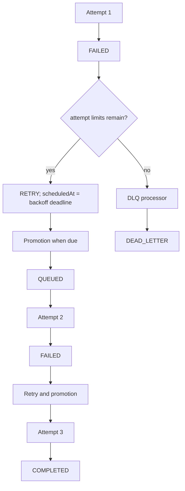
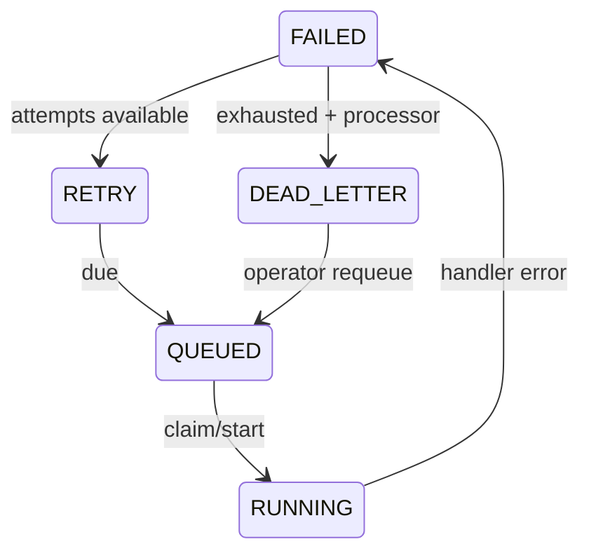

# Retry and Dead Letter Queue

## Retry Model

A failed concrete job retains its execution history and `attemptCount`. `RetryProcessor.scheduleFailedJob` checks both the job's `maxAttempts` and the selected queue policy's `maxAttempts`. If capacity remains, it changes `FAILED -> RETRY` and sets `scheduledAt` to the backoff deadline. A later promotion changes `RETRY -> QUEUED`.

Supported policies are `FIXED`, `LINEAR`, and `EXPONENTIAL`:

| Strategy | Delay calculation before cap |
|---|---|
| Fixed | `initialDelayMs` |
| Linear | `initialDelayMs * attemptCount` |
| Exponential | `initialDelayMs * backoffMultiplier^(attemptCount - 1)` |

Every delay is capped at `maxDelayMs` and validated as a non-negative safe integer. The schema includes `jitter`, but the current calculator does not apply jitter. Retry policy CRUD is not exposed by the API; policies are read through `GET /retry-policies`.

## Retry Flow

The current execution runtime records a failure but does not itself schedule that retry. The processor must be called by orchestration or an operator/API path. The bootstrap does promote already-scheduled retries.

## Dead Letter Queue

The DLQ processor converts exhausted `FAILED` jobs into `DEAD_LETTER` and creates one `DeadLetterEntry` with reason, error, attempt count, last worker, and timestamps. A unique `jobId` makes the diagnostic entry one-per-job, and the processor is transactionally idempotent. The HTTP API lists entries and can explicitly requeue an active entry. Requeue sets the job to `QUEUED`, clears ownership, resets `scheduledAt` to now, and records `requeuedAt`; it does not delete the historical entry.

DLQ is an operational quarantine: it separates repeatedly failing work from normal queue flow, preserves failure context, and creates a deliberate review/requeue boundary. It is not automatic deletion and does not guarantee that a requeued job will succeed.
