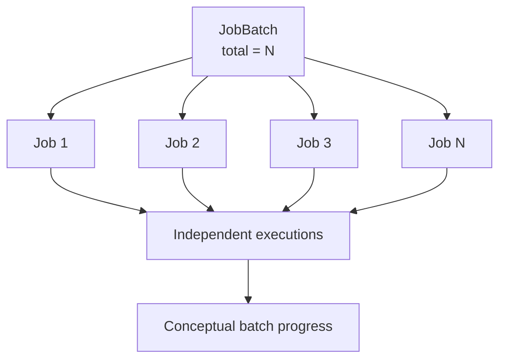

# Batch Jobs

## Model

A `JobBatch` gives a group of jobs a durable identity and stores `totalJobs`, `completedJobs`, `failedJobs`, and `pendingJobs`. Each child job has `batchId` and remains an independently claimable concrete job in the same queue.

## Creation

`POST /queues/:id/jobs/batch` requires a non-empty `jobs` array. Creation runs in one `ReadCommitted` transaction: the queue and retry policy are read, the batch is created with `pendingJobs = N`, and every child is inserted with inherited defaults for priority and max attempts. A future child `scheduledAt` becomes `SCHEDULED`; otherwise it is `QUEUED`. If any child creation fails, the transaction rolls back the batch and all children.

Each item may provide job type, opaque JSON payload, priority, scheduled time, max attempts, and idempotency key. The endpoint publishes one queued/scheduled event per child after the transaction.

## Execution and Rollup

Children execute independently unless a caller imposes dependencies; the schema has an optional `parentJobId` relationship, but batch creation does not establish parent/child dependencies. Partial failure is therefore possible and should be visible at child level.

The schema contains counter fields for a batch, but the current worker and lifecycle paths do not update them as children complete or fail. Therefore the initial counters accurately describe creation, while a live rollup is not currently guaranteed. A production rollup would need an atomic transition hook or a derived aggregate query with explicit retry semantics.

## API Response Shape

The creation response contains the batch row plus its created jobs. There is no dedicated batch read endpoint in the current API; evaluators can inspect child jobs through `GET /jobs?batchId=...` and see the batch ID on each job.
