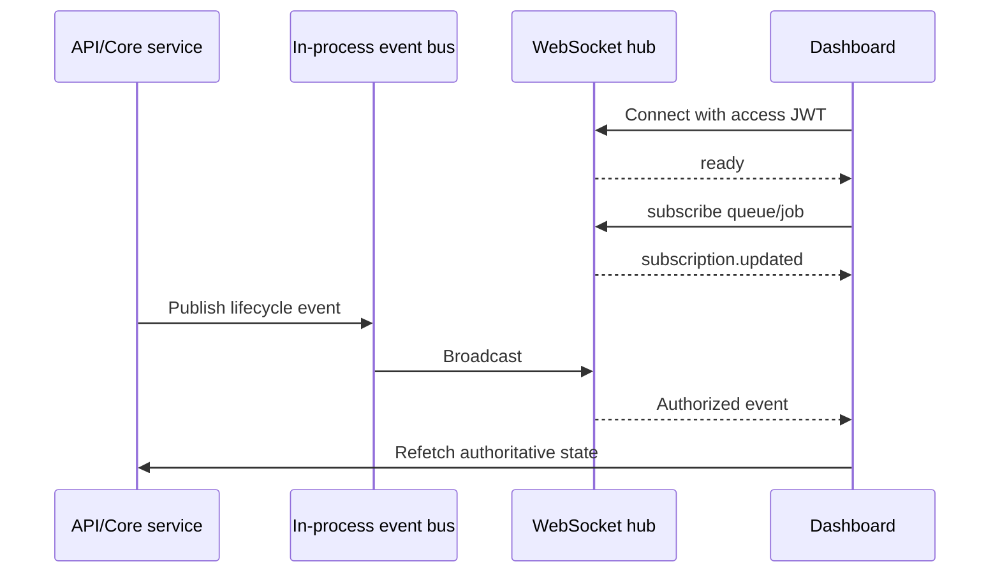

# WebSocket and Realtime

## Connection Contract

The WebSocket endpoint is `/ws?token=<access-jwt>`. The hub verifies the token before accepting the client and takes the token's organization IDs as the authorization context. API keys are not accepted for WebSocket authentication. A successful connection receives `{ "type": "ready" }`.

Clients send subscription messages:

```json
{"type":"subscribe","queueId":"QUEUE_UUID"}
{"type":"subscribe","jobId":"JOB_UUID"}
{"type":"unsubscribe","queueId":"QUEUE_UUID"}
```

The server looks up each resource and verifies that its organization is in the token context. It responds with `subscription.updated` containing the current queue and job subscription arrays. Invalid messages produce `VALIDATION_ERROR`; unauthorized or missing resources produce `FORBIDDEN`.

## Actual Event Types

`job.queued`, `job.claimed`, `job.running`, `job.completed`, `job.failed`, `job.retry`, `job.dead_lettered`, `job.cancelled`, `job.scheduled`, `job.schedule.promoted`, `worker.heartbeat`, `worker.offline`, and `worker.recovered`.

Events carry `eventId`, `occurredAt`, organization ID, optional project/queue/job/worker IDs, and payload fields such as status, previous status, current count, attempts, error code, and message.



The event bus and hub are process-local. Organization isolation is checked both when subscribing and when broadcasting; a client receives an event only when its organization matches and its queue/job subscription matches. The frontend socket client reconnects after 1.5 seconds and restores queue subscriptions. The dashboard retains a small recent event list and refetches data after accepted events, so events are notifications rather than a complete replicated state.

There is no durable event log, replay cursor, cross-process pub/sub, or guaranteed delivery acknowledgment. A disconnect can lose events, but a subsequent API refresh can recover current state.
