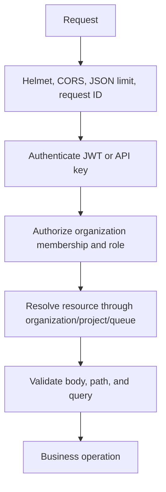

# Security

## Request Security Flow

JWT access tokens and refresh tokens are signed separately and carry token type, user identity, email, and organization IDs. Access tokens are short lived (15 minutes); refresh tokens last 7 days. Refresh rechecks that the user still exists and recomputes current memberships. Passwords are bcrypt-hashed and never returned.

API keys are generated as secrets, stored only as hashes, and returned in plaintext only on creation. They may expire or be revoked. HTTP API keys resolve to the organization owner identity. WebSockets require an access JWT in the `token` query parameter and do not accept API keys.

## Authorization and Tenancy

Resource queries resolve organization ownership through project and queue relationships. Project, queue, job, execution, worker, heartbeat, schedule, and DLQ access checks require membership in the relevant organization. Project creation additionally requires OWNER or ADMIN. Most other resource writes currently allow any organization member, so role granularity is intentionally limited and should not be described as per-resource RBAC.

The unique organization/resource relationships and membership checks prevent ordinary cross-tenant access. JWT organization IDs are used for initial context, while resource operations query membership. There is no organization switching or membership-administration UI.

## Input and Error Handling

Zod validates request envelopes, UUIDs, ISO datetimes, pagination, queue bounds, job attempt limits, and batch non-emptiness. JSON bodies are limited to 1 MB. Errors use structured status/code/message/details and avoid exposing passwords or credential material. Helmet is enabled and `X-Request-ID` supports correlation. Redis rate limits use one-minute windows with defaults of 10 auth, 120 reads, 60 writes, and 20 batches; rate-limit failure is fail-open.

Production deployment must replace the development JWT fallback (`dev-secret-change-me`) with a strong `JWT_SECRET`, protect database/Redis connectivity, use TLS at the edge, and treat payloads/log metadata as potentially sensitive. Tokens in frontend `sessionStorage` are exposed to same-origin script execution; this is a deliberate current implementation trade-off, not equivalent to HttpOnly-cookie protection.
