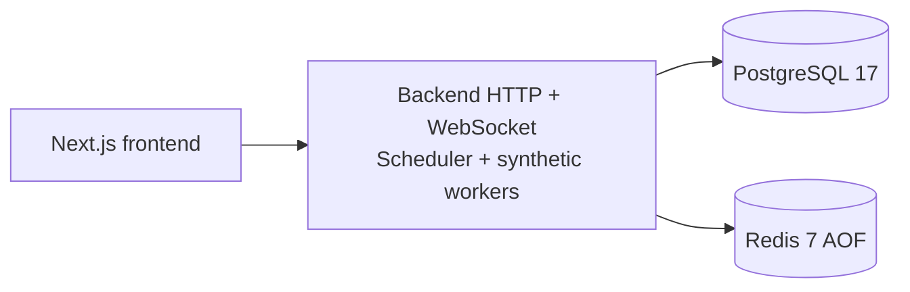

# Deployment and Setup

## Topology

Docker Compose provisions PostgreSQL 17 on host port `5433` with database `job_scheduler`, user `scheduler`, and persistent `postgres_data`; Redis 7 Alpine is exposed on `6379` with persistent `redis_data` and AOF enabled. Both services have health checks. Compose does not define backend or frontend services, so application processes remain separate from the dependency containers.

## Prerequisites and Configuration

The backend requires Node.js, PostgreSQL connectivity, Redis connectivity, and a generated Prisma client/schema state. Required environment variables are `DATABASE_URL` and `REDIS_URL`. Optional values include `PORT`, `JWT_SECRET`, `SCHEDULER_POLL_INTERVAL_MS`, `WORKER_POLL_INTERVAL_MS`, and rate-limit settings. The development JWT fallback must not be used in production.

The frontend is a Next.js application and reads the backend through its API client. Backend startup creates the HTTP server, attaches `/ws`, starts one runtime worker per existing queue, and starts the scheduler polling loop. The built-in runtime handler completes jobs successfully; it is a demonstration runtime, not an external business-handler deployment model.

## Production Considerations

Run migrations through the repository's Prisma workflow before serving traffic, provide managed PostgreSQL and Redis with backups/monitoring, keep secrets outside source control, terminate TLS at the edge, configure CORS narrowly, and size connection pools for API, scheduler, and workers. Add a process supervisor for restart and a shared metrics/event layer before horizontal API/WebSocket deployment. Schedule heartbeat emission and stale-worker recovery explicitly because the default bootstrap does not start those loops.

This document intentionally describes topology and configuration only. It does not assert a command transcript, benchmark, or successful deployment result.
