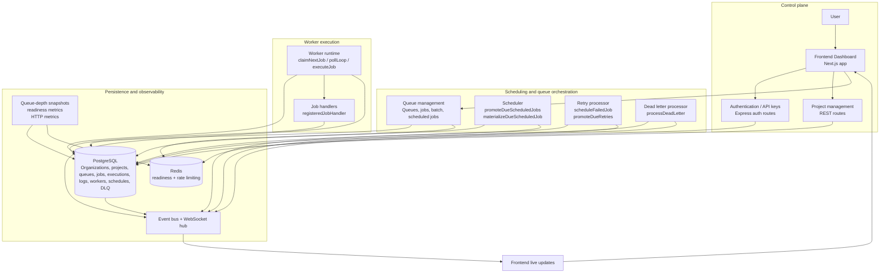

# Architecture

## System diagram

## Written explanation

### Request flow

A request enters the Express app in `backend/src/api/index.ts`. The app sets request IDs, records HTTP metrics, enables CORS and Helmet, parses JSON, and mounts the auth, project, and queue routes. Middleware enforces authentication and rate limits. On successful requests, the route reads or writes PostgreSQL data and responds with JSON. Error handling is centralized in `apiErrorHandler` and `notFoundHandler`.

### Job creation flow

A client creates a job by posting to `/queues/:id/jobs` or `/queues/:id/jobs/batch`. The route validates the payload with Zod, authorizes access through the owning organization, and inserts rows into the `Job` table. If the job has a `scheduledAt` in the future, the job is created with `status = SCHEDULED`; otherwise it is created with `status = QUEUED`.

### Job scheduling flow

The scheduler is a polling loop started by `backend/src/server.ts`. On each tick, the backend checks each queue, promotes due scheduled jobs from `SCHEDULED` to `QUEUED`, promotes due retries from `RETRY` to `QUEUED`, and materializes recurring schedules from `ScheduledJob` definitions into concrete `Job` records.

The `Scheduler` class is responsible for:

- validating cron expressions
- creating recurring job definitions
- materializing scheduled executions at the next due time
- promoting jobs whose `scheduledAt` has arrived

### Job claiming

The enquiry to claim the next job happens in `claimNextJob()`. The implementation locks the target queue row, checks queue pause and concurrency, and then selects one eligible `QUEUED` row that is due (`scheduledAt <= CURRENT_TIMESTAMP`). It uses PostgreSQL `FOR UPDATE SKIP LOCKED` to prevent two workers from claiming the same job at once.

### Job execution

A worker runtime is created per queue and polls for jobs while `activeJobs.size < concurrency`. When a job is claimed, the runtime sets the job to `RUNNING` and creates a `JobExecution` row with `attemptNumber = attemptCount + 1`. It then invokes the registered handler for the job type. The handler result decides whether the job completes or fails.

### Failure handling

If the handler returns a failure, the worker records the execution as `FAILED` and updates the parent `Job` to `FAILED`, clearing the claim information. The job remains linked to its execution history so the failure can be analyzed and retried.

### Retry flow

Retry handling is centralized in `RetryProcessor`. When a `FAILED` job is eligible for retry, the processor updates its status to `RETRY` and sets `scheduledAt` to `CURRENT_TIMESTAMP + delayMs`. The retry delay is calculated from the queue’s `RetryPolicy` and the job’s `attemptCount`.

The current implementation supports:

- `FIXED`: uses `initialDelayMs`
- `LINEAR`: uses `initialDelayMs * attemptCount`
- `EXPONENTIAL`: uses `initialDelayMs * backoffMultiplier^(attemptCount - 1)`

The actual logic is capped at the policy’s `maxDelayMs` and blocked when the job has reached `maxAttempts` or the retry policy max.

### DLQ flow

The `DeadLetterProcessor` checks `FAILED` jobs. If the job has exhausted its allowed attempts, the processor marks the job `DEAD_LETTER` and creates a `DeadLetterEntry` row. The route `POST /dlq/:id/requeue` can requeue the job to `QUEUED` by updating the job state and marking the DLQ entry as requeued.

### WebSocket update flow

The backend creates a `WebSocketHub` and attaches it to the HTTP server on `/ws`. Incoming clients send an access token in the URL query string, are authenticated with JWT verification, and then subscribe to queue or job updates. The `eventBus` emits job and worker events; the websocket hub broadcasts only to clients authorized for the corresponding organization and subscribed queue/job.

### Project isolation

Access is tied to organization membership. The JWT includes `orgIds`, and each route checks `OrganizationMember` records for the current user and organization. The app also filters project-scoped list queries to `organizationId` membership. This prevents a user from accessing another organization’s projects, queues, jobs, executions, or workers unless they are a member of that organization.

## Key architectural boundaries

- Control plane: auth, project management, queue/job operations, and readings from the dashboard
- Scheduling: recurring jobs and time-based promotion of due jobs
- Queue management: pause state, concurrency limits, default priority
- Worker execution: claim, run, retry, heartbeats, stale worker recovery
- Persistence: PostgreSQL schema and migrations
- Retry/DLQ: `RetryProcessor` and `DeadLetterProcessor`
- Real-time events: `eventBus` and `WebSocketHub`
- Observability: `/health`, `/ready`, `/metrics`, queue snapshots, and worker utilization endpoints

The code does not include a separate scheduler daemon or standalone worker binary; scheduler and workers are part of the same backend runtime bootstrap.
