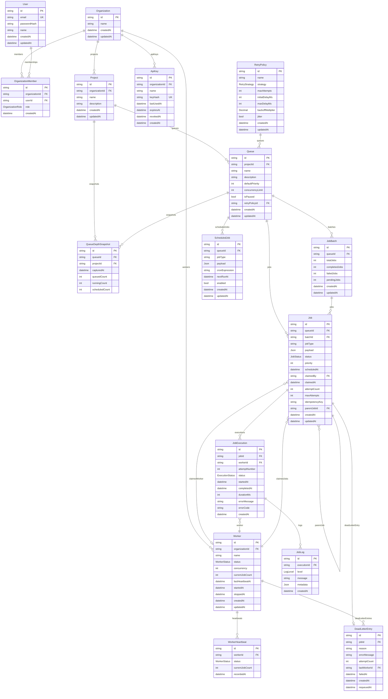

# ER Diagram

The Prisma schema in `backend/prisma/schema.prisma` is the source of truth for the durable data model. The diagram below reflects the actual models and relationships implemented in the project.

## Important relationships and constraints

- `Organization 1 ─── N OrganizationMember`
- `User 1 ─── N OrganizationMember`
- `Organization 1 ─── N Project`
- `Project 1 ─── N Queue`
- `RetryPolicy 1 ─── N Queue`
- `Queue 1 ─── N Job`
- `Queue 1 ─── N JobBatch`
- `Queue 1 ─── N ScheduledJob`
- `Queue 1 ─── N QueueDepthSnapshot`
- `Job 1 ─── N JobExecution`
- `JobExecution 1 ─── N JobLog`
- `Worker 1 ─── N JobExecution`
- `Worker 1 ─── N WorkerHeartbeat`
- `Job 1 ─── 0..1 DeadLetterEntry`
- `Job` can reference a parent `Job` via `parentJobId`, creating a self-relation for child jobs.
- `Job` has a `claimedBy` foreign key to `Worker` and is marked as claimed by a worker in the claim flow.
- `OrganizationMember` enforces a unique pair of `(organizationId, userId)` and a role enum of `OWNER`, `ADMIN`, or `MEMBER`.
- `Queue` enforces a unique pair of `(projectId, name)`.
- `Job` enforces `queueId + idempotencyKey` uniqueness when `idempotencyKey` is present.
- `ScheduledJob` is keyed by `queueId` and the due time index, while `QueueDepthSnapshot` is captured per queue and time bucket.

## Notes

This schema does not include separate tenant tables beyond the organization model. Authorization is primarily organizational, and routes restrict project and queue access by checking the current user’s membership in the relevant organization.
